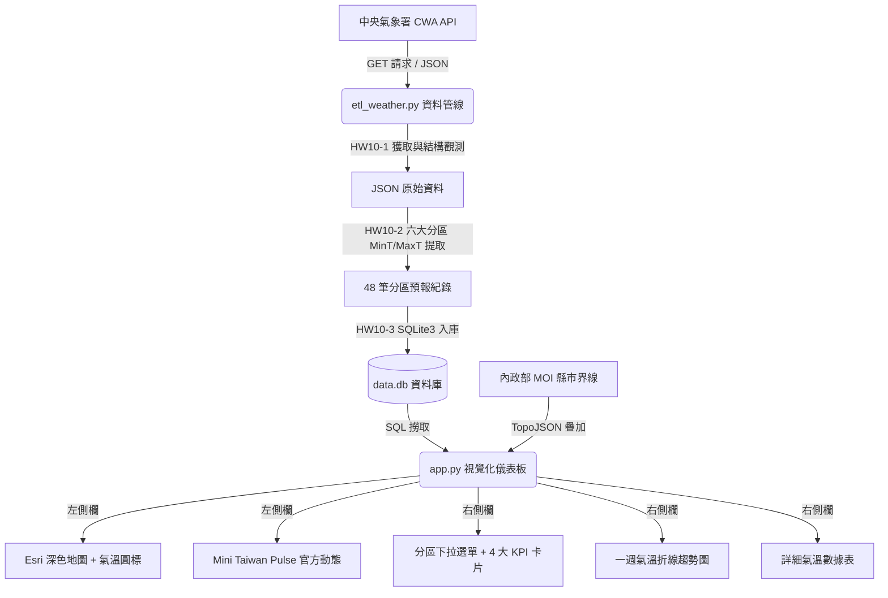

# 🌤️ TaiwanWeather 台灣全景氣候戰情室 (HW10)

> **基於中央氣象署 (CWA) 開放資料 API、SQLite3 資料庫與 Streamlit 構建之深色科技風氣候戰情室。**  
> 具備真實縣市行政分界、動態溫標燈號、一週雙軌趨勢折線圖與互動數據表，並深度整合 [Mini Taiwan Pulse](https://github.com/ianlkl11234s/mini-taiwan-pulse) 開發哲學。

---

## 📋 目錄
- [專案特色](#-專案特色)
- [系統架構](#-系統架構)
- [專案目錄結構](#-專案目錄結構)
- [環境安裝與設定](#-環境安裝與設定)
- [快速啟動指南](#-快速啟動指南)
- [功能展示與截圖](#-功能展示與截圖)
- [技術堆疊](#-技術堆疊)
- [參考來源與鳴謝](#-參考來源與鳴謝)

---

## ✨ 專案特色

1. **🚀 現代化 ETL 容錯管線**：
   - 串接中央氣象署 (CWA) RESTful API。
   - 針對 2026 年氣象署開放資料集變動實作**自動備援機制**（相容 `F-A0010-001` 與 `F-D0047-091` 一週預報），確保全天候穩定獲取即時資料。
   - 每日溫差精準聚合，解決同一日多時段覆蓋導致的極端值失真問題。

2. **🗺️ 高精度真實臺灣地圖**：
   - 整合全球頂級 **Esri World Dark Gray** 深黑科技底圖，完全免 API Key、零浮水印。
   - 疊加內政部官方 **臺灣縣市行政分界線**（青藍霓虹線條），清晰劃分全臺各縣市與鄉鎮。
   - 各分區標註動態氣溫脈衝光環，點擊即彈出即時 MinT / MaxT / 均溫預報卡片。

3. **📊 互動式數據儀表板**：
   - 左右平衡分欄佈局。
   - **4 大 KPI 指標卡**（本週最低、本週最高、一週均溫、日夜最大溫差）。
   - **一週最高溫 vs 最低溫雙色趨勢折線圖**。
   - **原生深黑質感數據表**，支援直覺排序與捲動。

4. **⚡ 三模整合 Mini Taiwan Pulse 與環境圖層**：
   - 內建一鍵切換控制器，支援氣溫預報、即時空氣品質與 [Mini Taiwan Pulse](https://github.com/ianlkl11234s/mini-taiwan-pulse) 官方即時海空動態。

5. **🚨 CWA 天氣特報與全台即時觀測極端值**：
   - 串接中央氣象署 `W-C0033-001` 天氣特報與 `O-A0003-001` 全台 360+ 測站即時觀測，展現今日最高溫、最低溫、最大雨量與最大風速。

6. **🫧 全國即時空氣品質指標 (AQI) 監測中心**：
   - 全台六大分區即時 AQI、PM2.5、PM10 監測與動態健康燈號。
   - 支援臺灣環境部 (MOENV) 官方 API 與 Open-Meteo 免 Key 高精度即時空品通道。

---

## 🏛️ 系統架構



---


## 📁 專案目錄結構

```text
Weather/
├── .streamlit/
│   └── config.toml               # Streamlit 全域深黑主題配置
├── 啟動天氣戰情室.bat             # ⚡ Windows 一鍵啟動 (自動偵測環境、補齊資料庫並開啟瀏覽器)
├── 建立桌面捷徑.bat               # 🖥️ 自動在桌面產生「🌤️ 氣象戰情室」一鍵啟動捷徑
├── run.bat                       # 一鍵啟動之快捷別名 (等同 啟動天氣戰情室.bat)
├── run.py                        # 跨平台一鍵整合啟動腳本 (Python 入口)
├── data.db                       # SQLite3 資料庫 (執行 etl_weather.py 後自動建立)
├── etl_weather.py                # HW10-1 ~ HW10-3: ETL 資料擷取、解析與入庫腳本
├── app.py                        # HW10-4: Streamlit 互動視覺化戰情室
├── taiwan_topo.json              # 內政部官方臺灣縣市行政區界線 TopoJSON
├── requirements.txt              # Python 套件依賴清單
└── README.md                     # 專案說明文件
```

---

## 🔧 環境安裝與設定

### 1. Python 環境需求
- Python 3.10 以上版本。

### 2. 安裝必要套件
```bash
pip install -r requirements.txt
```

套件依賴內容：
```text
requests>=2.31.0
pandas>=2.0.0
streamlit>=1.30.0
folium>=0.15.0
streamlit-folium>=0.20.0
```

---

## 🚀 快速啟動指南

### ⚡ 方案 A：一鍵開啟（推薦最佳體驗）

本專案已為您完全整合一鍵自動啟動機制，包含環境檢查、自動更新資料庫與自動彈出瀏覽器：

- **方式 1（最推薦）雙擊批次檔**：
  直接在資料夾中雙擊 **`啟動天氣戰情室.bat`**（或 **`run.bat`**）。
- **方式 2（桌面極速捷徑）**：
  雙擊 **`建立桌面捷徑.bat`**，系統將自動於您的 Windows 桌面上生成「🌤️ 氣象戰情室」圖示，日後在桌面點兩下即可一鍵開啟！
- **方式 3（Python 跨平台入口）**：
  ```bash
  python run.py
  ```

---

### 🛠️ 方案 B：分步手動啟動 (HW10 規範驗證)

#### 步驟 1：執行 ETL 資料管線 (HW10-1 ~ HW10-3)

在終端機中執行：
```bash
python etl_weather.py
```

* **執行後終端機驗收輸出**：
  1. 印出 `[HW10-1]` CWA API 原始 JSON 前 600 字元。
  2. 印出 `[HW10-2]` 提取後之氣溫字典結構前 3 筆範例。
  3. 自動在根目錄生成 `data.db` 並寫入 48 筆資料。
  4. 印出 `[HW10-3]` 驗證 1（六大分區名稱清單）。
  5. 印出 `[HW10-3]` 驗證 2（中部地區一週氣溫 DataFrame 表格）。

---

### 步驟 2：啟動 Streamlit 視覺化戰情室 (HW10-4)

在終端機中執行：
```bash
streamlit run app.py
```

瀏覽器開啟：`http://localhost:8501`

* **操作要點**：
  - **頂部**：點擊「🔄 同步 CWA 最新氣象」按鈕，可即時觸發後台重新抓取氣象署最新數據並自動重整。
  - **左側欄**：
    - 「選擇預報日期」下拉選單，動態切換當日全台氣溫分佈。
    - 支援雙標籤頁：「🛰️ 氣溫戰情地圖（含真實縣市界線）」與「⚡ Mini Taiwan Pulse 官方動態」。
    - 點擊地圖圓圈可彈出分區氣溫詳情。
  - **右側欄**：
    - 「選擇查詢地區」下拉選單，切換顯示不同分區的一週 4 大 KPI、折線趨勢圖與詳細數據表。

---

## 🎨 溫標色彩規範

依照作業 HW10 規範對應平均氣溫：
- 🔵 **寒冷**：`< 20°C` (`#38bdf8` 酷冷電藍)
- 🟢 **舒適**：`20 ~ 25°C` (`#10b981` 螢光翡翠綠)
- 🟠 **溫暖**：`25 ~ 30°C` (`#f59e0b` 琥珀亮橙)
- 🔴 **炎熱**：`> 30°C` (`#f43f5e` 霓虹熱紅)

---

## 💻 技術堆疊

- **核心語言**：Python 3.12
- **網頁框架**：Streamlit
- **地圖引擎**：Folium / Leaflet / Esri World Dark Gray
- **地理圖資**：中華民國內政部國土測繪中心 (MOI TopoJSON)
- **資料處理**：Pandas, Requests
- **資料儲存**：SQLite3
- **前端字體**：`Syne`, `Space Grotesk`, `JetBrains Mono`

---

## 📚 參考來源與鳴謝

- **中央氣象署**：[氣象資料開放平臺](https://opendata.cwa.gov.tw/)
- **Mini Taiwan Pulse**：[ianlkl11234s/mini-taiwan-pulse](https://github.com/ianlkl11234s/mini-taiwan-pulse)
- **內政部地理圖資**：臺灣縣市行政區邊界向量開源資料
