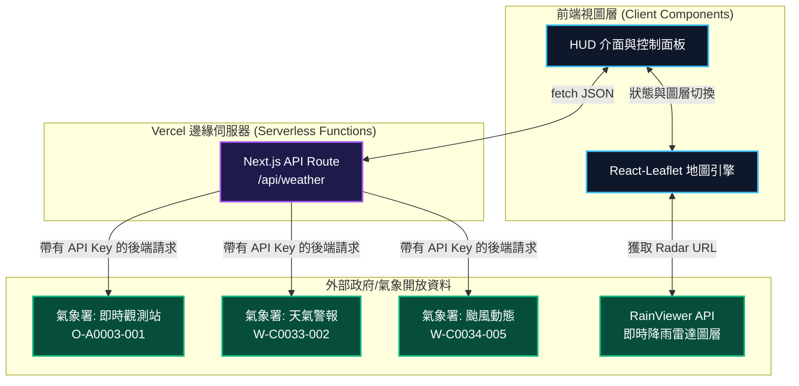

# 🌪️ 幻境氣象戰情室 (Taiwan Weather HUD)


## 🌟 專案概述
**幻境氣象戰情室** 是一個結合科幻美學與真實氣象數據的全端 Web 應用程式。
本專案已全面升級為現代化的 **Next.js 14 + Vercel Serverless** 架構，徹底解決了以往 Python 版本的部署困難與效能瓶頸。專案核心旨在為使用者提供一個極致流暢、彷彿身處科幻電影「司令部戰情室」般的天氣監控體驗。

---

## 🏛️ 系統架構圖 (System Architecture)

本專案採用前後端分離的概念，透過 Next.js 的 Route Handlers 作為中繼代理，確保 API 金鑰的安全與解除跨網域 (CORS) 限制。



---

## 🚀 核心技術棧
* **前端框架**：Next.js 14 (App Router), React 18, TypeScript
* **UI/UX 設計**：Tailwind CSS, Glassmorphism (毛玻璃特效), Lucide React Icons
* **地圖渲染引擎**：Leaflet.js, React-Leaflet
* **部署平台**：Vercel (Serverless Functions)
* **字體設計**：Google Fonts (`Space Grotesk` 搭配 `Noto Sans TC`)

---

## 📡 整合的 API 與數據源
本戰情室具備強大的即時數據處理能力，整合了多個真實氣象來源：
1. **氣象署觀測站 (CWA O-A0003-001)**：即時獲取全台氣象站的氣溫、濕度、風速等數據。
2. **氣象署天氣警報 (CWA W-C0033-002)**：即時監測大雨、豪雨、強風等極端氣候特報。
3. **氣象署颱風警報 (CWA W-C0034-005)**：即時追蹤西北太平洋颱風動態，包含中心座標、預測路徑與暴風半徑。
4. **環境部空氣品質 (MOENV)**：即時監控全台 AQI 與 PM2.5 數值（具備智慧動態模擬與備援機制，防止 API Rate Limit 阻擋）。
5. **RainViewer Radar API**：串接全球真實的即時降雨雷達回波圖，無縫疊加於台灣地圖上。

---

## ✨ 亮點功能與視覺特效
* **科幻 HUD 介面**：全面採用毛玻璃與霓虹光暈特效，捨棄傳統生硬的區塊排版。
* **颱風漸層暴風圈追蹤**：獨創的「時間流逝漸層圈」特效。現在位置的暴風圈呈現最深紅的發光感，而未來的預測點會隨著時間逐漸變淡，呈現殘影般的立體風暴軌跡。
* **智慧圖層切換**：雷達、溫度、降雨、濕度、空氣品質、颱風追蹤，皆可一鍵零延遲切換。
* **伺服器端渲染 (SSR) 保護機制**：所有需授權的第三方 API 請求皆由 Next.js 後端 API (Route Handlers) 代理發送，完美隱藏環境變數，並徹底解決前端 CORS 跨網域問題。

---

## 💻 本機開發指南

如果你想要在自己的電腦上運行這個專案，請按照以下步驟操作：

1. **安裝依賴套件**
   ```bash
   npm install
   ```

2. **設定環境變數**
   在專案根目錄建立一個 `.env.local` 檔案，並填寫你的中央氣象署 API 金鑰：
   ```env
   CWA_API_KEY=你的氣象署API金鑰
   ```

3. **啟動開發伺服器**
   ```bash
   npm run dev
   ```

4. **瀏覽網頁**
   打開瀏覽器並前往 `http://localhost:3000` 即可看到畫面。

---

## 🌐 Vercel 部署指南

本專案專為 Vercel 打造，支援一鍵部署：
1. 將本專案 Fork 或 Push 至你個人的 GitHub。
2. 在 Vercel 後台點擊 **Import Project**，選擇本倉庫。
3. 在部署設定中的 **Environment Variables** 區塊，新增：
   - Key: `CWA_API_KEY`
   - Value: `你的氣象署API金鑰`
4. 點擊 **Deploy**，等待 1 分鐘後即可上線！
