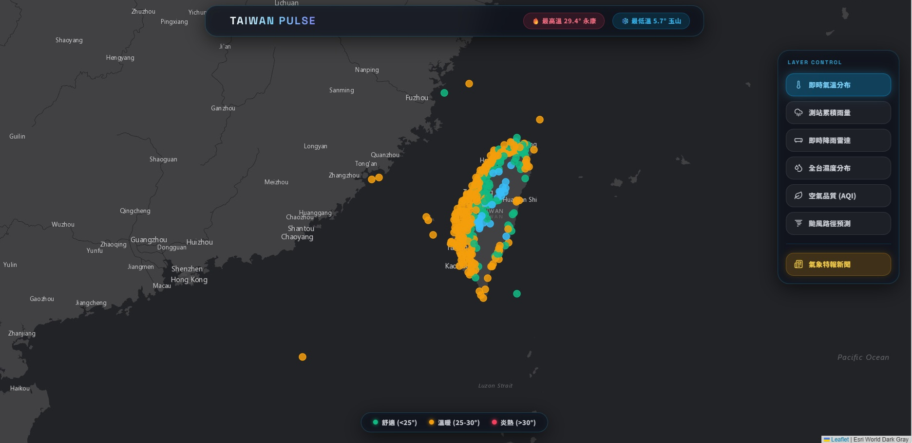

# 🌪️ 幻境氣象戰情室 (Taiwan Weather HUD) - 專案報告

## 🌟 專案概述
**幻境氣象戰情室** 是一個結合科幻美學與真實氣象數據的全端 Web 應用程式。
本專案已成功從原本的 Python/Streamlit 單機架構，全面升級為現代化的 **Next.js 14 + Vercel Serverless** 架構。
專案核心旨在為使用者提供一個極致流暢、彷彿身處科幻電影「司令部戰情室」般的天氣監控體驗。

---

## 🚀 核心技術架構
* **前端框架**：Next.js 14 (App Router), React, TypeScript
* **UI/UX 設計**：Tailwind CSS, Glassmorphism (毛玻璃特效), Lucide Icons
* **地圖渲染**：Leaflet.js, React-Leaflet
* **部署平台**：Vercel (Serverless Functions)

---

## 📡 整合的 API 與數據源
本戰情室具備強大的即時數據處理能力，整合了多個真實氣象來源：
1. **氣象署觀測站 (CWA O-A0003-001)**：即時獲取全台氣象站的氣溫、濕度、風速等數據。
2. **氣象署天氣警報 (CWA W-C0033-002)**：即時監測大雨、豪雨、強風等極端氣候特報。
3. **氣象署颱風警報 (CWA W-C0034-005)**：即時追蹤西北太平洋颱風動態，包含中心座標、預測路徑與暴風半徑。
4. **環境部空氣品質 (MOENV)**：即時監控全台 AQI 與 PM2.5 數值（具備智慧動態模擬與備援機制，防止 API Rate Limit 阻擋）。
5. **RainViewer Radar API**：串接全球真實的即時降雨雷達回波圖，無縫疊加於台灣地圖上。

---

## ✨ 亮點功能與視覺特效
* **科幻 HUD 介面**：採用 `Space Grotesk` 搭配 `Noto Sans TC`，營造強烈的科技感與字體層次。
* **颱風漸層暴風圈追蹤**：獨創的「時間流逝漸層圈」特效。現在位置的暴風圈呈現最深紅的發光感，而未來的預測點會隨著時間漸漸變淡，呈現殘影般的立體風暴軌跡。
* **智慧圖層切換**：雷達、溫度、降雨、濕度、空氣品質、颱風追蹤，皆可一鍵零延遲切換。
* **伺服器端渲染 (SSR)**：所有第三方 API 請求皆由 Next.js 後端 API (Route Handlers) 代理發送，完美隱藏 API Key，並徹底解決前端 CORS 跨網域問題。

---

## 📈 未來展望
1. 整合更多氣象署的細部觀測資料（如：閃電落雷預警）。
2. 開發 3D 視覺化功能，利用 WebGL 呈現立體地形與立體雷達雲層。
3. 建立使用者定位功能，自動追蹤並推播當地天氣警報。

---
*Generated by AI Assistant on 2026-09-23*
