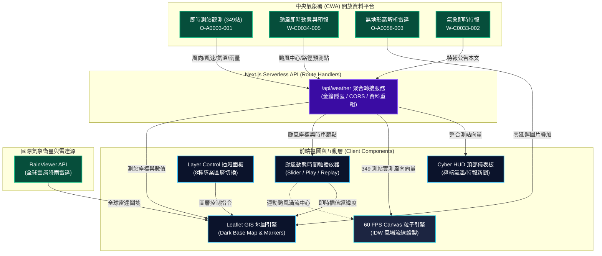

# 🌪️ 幻境氣象戰情室 (Taiwan Pulse Weather HUD)


<div align="center">


</div>

---

## 🌟 專案概述 (Overview)

**幻境氣象戰情室 (Taiwan Pulse)** 是一個專為全方位氣象監控量身打造的高科技 Cyberpunk 風格氣象戰情平台。

本專案全面採用現代化的 **Next.js 14 App Router + Vercel Serverless** 架構，結合純前端高效能 **HTML5 Canvas 粒子引擎** 與 **React-Leaflet 地圖技術**，將中央氣象署 (CWA) 複雜的海量數據轉化為極具視覺震撼力、如科幻電影司令部般的即時監控介面。

---

## 🏛️ 系統架構流程圖 (System Architecture)



---

## ⚡ 核心功能特色 (Key Features)

### 1. 💨 全球動態氣流場 (Wind Stream 粒子流線分析)
* **349 處真實測站空間內插**：徹底告別靜態或偽造風向，全面串接全台 349 處氣象局自動測站即時實測數值。
* **IDW (Inverse Distance Weighting) 逆距離加權演算法**：針對任意經緯度，自動計算鄰近測站之 $U$ (東西向分量) 與 $V$ (南北向分量) 向量融合成流場。
* **60 FPS 流暢 Canvas 渲染**：數千顆具備自適應生命週期與速度拖曳尾跡的螢光粒子，依風速大小自動渲染冰藍、電綠、霓黃至狂風桃紅漸層。

### 2. 🌀 颱風「動態路徑預測模擬播放器」 (Typhoon Interactive Timeline)
* **實時平滑軌跡插值**：將當前暴風中心與氣象署未來多日預測點（Surigae 等活躍氣旋）進行平滑運動插值。
* **底部 Cyber 懸浮時間軸控制器**：
  * ⏯️ **播放 / 暫停**：以動態動畫即時預覽颱風未來 96 小時逼近海域之動態。
  * 🔄 **一鍵重播**：瞬間將時間歸零重啟模擬。
  * 🎚️ **互動式時間拖曳拉桿**：自由拖曳時間軸，隨選查看任何特定未來時刻的推估座標與登陸動線。
  * 📡 **即時遙測 HUD**：同步顯示預測時間點、即時經緯度座標、中心氣壓與風暴進度。
* **動態氣旋眼與渦流連動**：中心搭載逆時針旋轉的 SVG 暴風眼圖示與脈衝光圈，外海氣流場粒子會自動受到颱風低壓引力牽引、螺旋吸入風眼！

### 3. 🛰️ 雙雷達監控系統 (Dual Radar System)
* 🎯 **台灣雷達 (CWA 官方無地形高解析)**：透過 Leaflet `ImageOverlay` 將氣象署每 10 分鐘發布之透明無地形雷達圖完美對齊台灣地理座標，清晰透視雲雨區。
* 📡 **全球降雨雷達 (RainViewer API)**：串接國際雷達衛星動態圖塊，提供宏觀跨國界降水動態。

### 4. 📊 多維度全方位氣象圖層
* 🌡️ **即時氣溫分布**：全台測站氣溫視覺化，自動偵測全台極端「最高溫」與「最低溫」測站快訊。
* 🌧️ **測站累積雨量**：多色階雨量光圈（微雨 > 大雨 > 豪雨）。
* 💧 **全台濕度分布**：即時乾燥、舒適與潮濕分佈監測。
* 🍃 **空氣品質監控 (AQI)**：全台空氣品質指數與 PM2.5 實時動態標籤。
* 📰 **中央氣象署即時特報新聞**：一鍵開啟懸浮毛玻璃視窗，閱讀氣象署發布之最新豪雨、強風或低溫特報。

---

## 🛠️ 技術規格 (Tech Stack)

| 領域 | 技術 / 套件 | 說明 |
| :--- | :--- | :--- |
| **框架** | Next.js 14 (App Router) | 高效能 React 框架，支援伺服器端路由代理 |
| **語言** | TypeScript | 提供嚴格型別校驗與代碼穩定度 |
| **樣式** | Tailwind CSS + 自訂毛玻璃 | 極致 Cyberpunk / Glassmorphism 視覺質感 |
| **地圖渲染** | Leaflet + React-Leaflet | 輕量且擴充性極佳的開源地圖核心 |
| **向量流場** | HTML5 2D Canvas Engine | 獨立於地圖 DOM 之外的超高訊噪比粒子流場系統 |
| **圖標設計** | Lucide React | 精美現代的線條向量圖標庫 |
| **字體系統** | Space Grotesk + Noto Sans TC | 兼具科技感數字與繁體中文閱讀體驗 |

---

## 💻 本地端運行指南 (Local Development)

### 1. 複製專案與安裝依賴
```bash
git clone https://github.com/jex1235-coder/TaiwanWeather.git
cd TaiwanWeather
npm install
```

### 2. 設定環境變數
在專案根目錄下建立 `.env.local` 檔案，填入你的中央氣象署開放資料平台金鑰：
```env
CWA_API_KEY=你的中央氣象署API授權碼
```
> 💡 *若尚未申請，可至 [氣象資料開放平台](https://opendata.cwa.gov.tw/) 免費申請會員獲取授權碼。*

### 3. 啟動本機開發伺服器
```bash
npm run dev
```
打開瀏覽器訪問 `http://localhost:3000` 即可進入戰情室！

---

## 🚀 部署至 Vercel (Vercel Deployment)

本專案完全適配 Vercel Serverless 架構，推薦使用 Vercel 進行一鍵持續整合與部署：

1. 將本專案推送至 GitHub。
2. 登入 [Vercel](https://vercel.com/)，點選 **Add New...** > **Project** 並選取該 GitHub 倉庫。
3. 在 **Environment Variables (環境變數)** 區塊新增：
   * **Key**: `CWA_API_KEY`
   * **Value**: `你的氣象署API授權碼`
4. 點選 **Deploy**，約一分鐘內即可自動建置完成並上線！

---

<div align="center">
Made with ❤️ for Taiwan Weather Enthusiasts.
</div>
